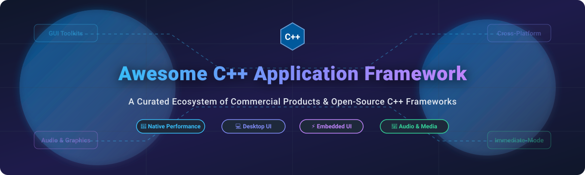

  
  
  
  
  
  
  

  

# 🚀 Awesome C++ Application Framework

> A curated list of top-tier commercial products and production-grade open-source C++ application frameworks, GUI toolkits, audio engines, and cross-platform libraries.

**Last updated: October 2026**

---

## 💡 Overview & SEO Keywords

The **C++ application framework ecosystem** powers high-performance desktop software, real-time audio processors, embedded system interfaces, and graphical tools across Windows, macOS, Linux, iOS, Android, and WebAssembly.

This repository catalogs key **commercial solutions** and **open-source C++ libraries** categorized for system architects, desktop developers, audio engineers, and embedded software teams searching for:
- **C++ GUI Toolkits**: Cross-platform native and immediate-mode GUIs.
- **Application Frameworks**: Full-stack C++ libraries providing event loops, networking, data binding, and modular architectures.
- **Audio & Multimedia Engines**: Frameworks designed for VST plugins, DAWs, and digital signal processing (DSP).
- **Embedded & Lightweight UIs**: Low-footprint, fast UI frameworks tailored for resource-constrained hardware.

---

## 📑 Table of Contents

- [💼 Commercial Products](#-commercial-products)
- [🔓 Open-Source GitHub Projects](#-open-source-github-projects)
- [🤝 How to Contribute](#-how-to-contribute)
- [⚠️ Disclaimer](#-disclaimer)
- [📈 Star History](#-star-history)
- [💖 Support & Community](#-support--community)

---

## 💼 Commercial Products

> **📊 Market Context & Size**: The global market for C++ GUI application frameworks and developer software tools is estimated at **~$1.8 Billion** (2026), growing at a ~7.2% CAGR. The commercial segment is **highly concentrated** (winner-take-all dynamics) with **Qt** dominating cross-platform commercial application development, while **Microsoft MFC** and **Embarcadero VCL** hold enterprise desktop legacy segments on Windows.

Products are sorted by company size/market valuation (descending).

| Product | Description | Pricing (Starting Tier) | Free Tier / Trial Limits | Company Size / Valuation |
| :--- | :--- | :--- | :--- | :--- |
| **[Microsoft Foundation Class (MFC)](https://learn.microsoft.com/en-us/cpp/mfc/mfc-desktop-applications)** | **Classic Windows C++ Framework.** Ships with Visual Studio, wrapping Win32 APIs for enterprise Windows desktop software. | **$45/month** (bundled with Visual Studio Professional subscription) | **Visual Studio Community is free** for individual developers & small orgs (<$1M revenue, <5 users); MFC workload required. | **~$3.1 Trillion** market cap / ~$281B revenue (Microsoft FY2025) |
| **[Qt Commercial](https://www.qt.io/development/qt-framework/commercial-qt)** | **Comprehensive Cross-Platform Application Framework.** Full QML, Qt Quick, Widgets, Multimedia, and Embedded Device Creation modules. | **$3,950/year** per developer (Application Development Professional subscription) | **10-day evaluation trial** (requires sales request, strictly no commercial product development allowed during trial). | **~$1.8 Billion** market cap / ~$210M annual revenue (Qt Group Oyj) |
| **[C++Builder VCL](https://www.embarcadero.com/products/cbuilder)** | **Native Windows Visual Component Library.** Accelerated visual application builder for data-intensive Windows software. | **$1,599/year** (Professional edition single-user license) | **Community Edition is free** for freelancers and early-stage projects with **annual revenue under $5,000**. | **~$500 Million** estimated valuation (Idera, Inc. parent company) |

---

## 🔓 Open-Source GitHub Projects

Sorted strictly by GitHub Stars_Count in descending order.

| Repo | Description | GitHub_Stars |
| :--- | :--- | :--- |
| **[Dear ImGui](https://github.com/ocornut/imgui)** | **Immediate-mode GUI library for game engines and tools.** Minimalist, renderer-agnostic, fast C++ UI framework with zero dependencies. MIT License. |  |
| **[raylib](https://github.com/raysan5/raylib)** | **Simple and easy-to-use C/C++ library for video game programming and interactive GUI apps.** Includes raygui for immediate-mode tools. zlib/libpng License. |  |
| **[Slint](https://github.com/slint-ui/slint)** | **Declarative GUI toolkit for desktop and embedded applications.** Supports C++, Rust, and JavaScript with modern design tools. Royalty-free / GPLv3 / Commercial License. |  |
| **[POCO C++ Libraries](https://github.com/pocoproject/poco)** | **Network-centric and application development framework.** Enterprise-grade C++ libraries for building network apps, HTTP servers, XML, and data access layer. Boost Software License. |  |
| **[Boost](https://github.com/boostorg/boost)** | **The C++ standard library proving ground.** Peer-reviewed portable C++ source libraries covering async I/O, threads, filesystem, math, and structures. Boost Software License. |  |
| **[JUCE](https://github.com/juce-framework/JUCE)** | **Audio application development framework.** Industry standard for building cross-platform audio plugins (VST, AU, AAX), DAWs, and DSP software. JUCE Personal free (<$50K rev), GPLv3 / Paid Tier. |  |
| **[wxWidgets](https://github.com/wxWidgets/wxWidgets)** | **Cross-platform native C++ GUI library.** Uses native OS widgets so applications look and behave natively on Windows, macOS, and Linux. wxWindows Library Licence (LGPL exception). |  |
| **[GTKmm](https://github.com/GNOME/gtkmm)** | **Official C++ interface for GTK GUI toolkit.** Provides typesafe C++ signals/slots and modern widget layouts for cross-platform desktop applications. GNU LGPL License. |  |
| **[NanoGUI](https://github.com/wjakob/nanogui)** | **Minimalistic cross-platform GUI library for OpenGL / GLFW.** Vector graphic design suitable for scientific visualization and 3D graphics applications. BSD License. |  |
| **[Ultralight](https://github.com/ultralight-ux/Ultralight)** | **Lightweight HTML/CSS UI rendering engine for C++ applications.** Enables embedding web-based user interfaces into desktop C++ software with minimal memory footprint. Free for indie / Commercial License. |  |
| **[RmlUi](https://github.com/mikke89/RmlUi)** | **C++ user interface library based on HTML and CSS standards.** Designed for realtime applications, games, and customized desktop UI layouts. MIT License. |  |
| **[FLTK](https://github.com/fltk/fltk)** | **Fast Light Toolkit (FLTK) for cross-platform GUI development.** Extremely small footprint and fast compilation times with minimal OS dependencies. GNU LGPL License with exception. |  |
| **[Nana](https://github.com/cnjerryu/nana)** | **Modern C++ GUI library.** Provides modern C++ style (lambda expressions, smart pointers) for creating cross-platform desktop interfaces smoothly. Boost Software License. |  |
| **[CEGUI](https://github.com/cegui/cegui)** | **Crazy Eddie's GUI System.** Flexible windowing and GUI toolkit engineered specifically for 3D games and graphics rendering engines. MIT License. |  |

---

## 🤝 How to Contribute

1. 🍴 **Fork** this repository.
2. ✏️ Add or update entries in `README.md` following the exact table structure.
3. 📝 Include project name, official website/GitHub link, brief 1-2 sentence description, and exact license model.
4. 🔀 Submit a Pull Request with clear commit notes.

---

## ⚠️ Disclaimer

- This list is **community-curated** for developer reference.
- Verify licensing obligations (GPL, LGPL, MIT, Commercial) before integrating any application framework into closed-source or enterprise applications.
- Curated reference lists follow guidelines from [Awesome-Awesome-Awesome](https://github.com/ishandutta2007/Awesome-Awesome-Awesome).

---

## 📈 Star History

---

## 💖 Support & Community

If you find this curated list of C++ Application Frameworks helpful, please consider supporting the repository:

- ⭐ **Star** this repository to help other C++ developers discover it.
- 🍴 **Fork** and contribute new C++ libraries, GUI frameworks, or tools.
- 📢 **Share** with developer communities, forums, and team members.
- ☕ **Sponsor**: Support ongoing maintenance via the [GitHub Sponsor Dashboard](https://github.com/sponsors/ishandutta2007).
